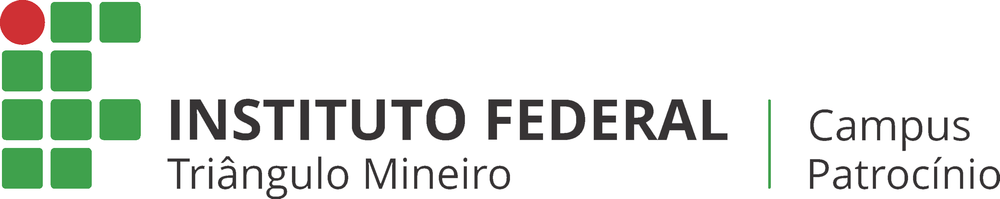

# corridaconscientizadora
Jogo gratuito para apoio na conscientização sobre os perigos do aedes aegypti. O jogo foi desenvolvido como parte de um trabalho com os alunos responsáveis na Instituição Federal do Triângulo Mineiro - Campus Patrocínio.

Sinta-se convidado a colaborar com o projeto!

**Alunos Responsáveis pelo projeto**
- Jairo Eliakim
- Maxsuel Oliveira

**Professor Orientador**
- Gilberto Viana de Oliveira

